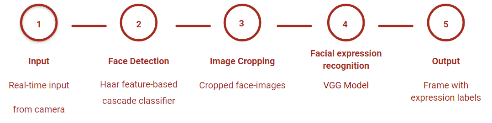
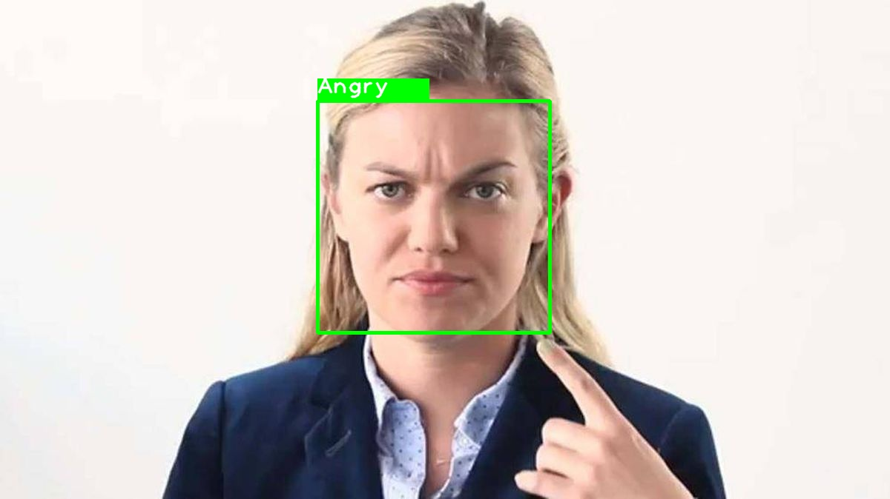
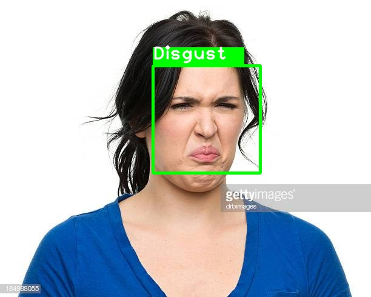
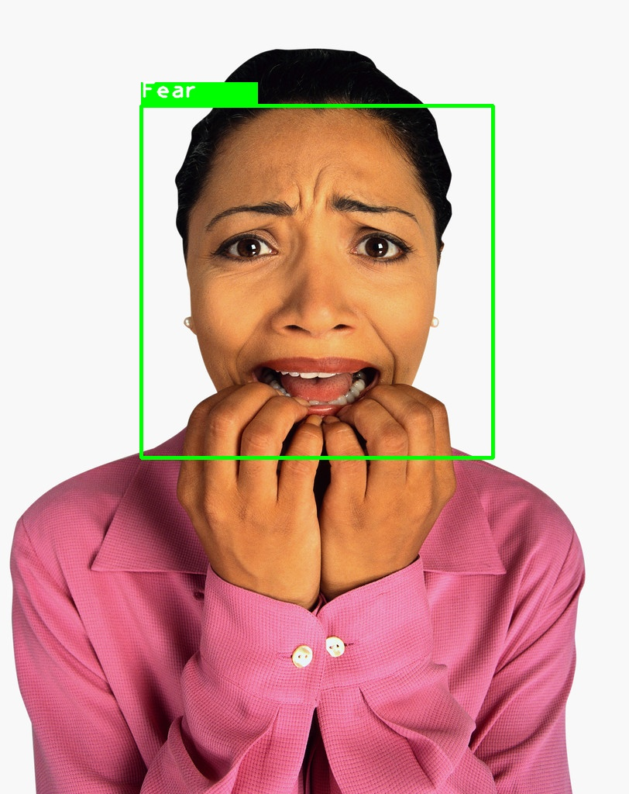

# Facial Expression Classifier

The goal of this project is to do real-time facial expression recognition.

## System Overview

## Built With
+ OpenCV-Haar Cascade: Face Datection
+ PyTorch: Building the classifier NN
+ OpenCV: Real-time video capture

## Environment Setup
Python packages are listed in requirements.txt.

    $ pip install -r requirements.txt

## Datasets
Note: the path to store dataset can be changed in each code.
1. [Fer2013](https://www.kaggle.com/c/challenges-in-representation-learning-facial-expression-recognition-challenge/data)
    + Dataset from Kaggle Competition.
    + Seven categories (Angry, Disgust, Fear, Happy, Sad, Surprise, Neutral)
    + Grayscale and 48 x 48 pixels
    + 28709 images for training set, 3589 for public and private set respectively
    + Use [fer2013_dataset.py](./fer2013_dataset.py) to convert the data into images and split the data into 3 sets.

            $ python fer2013_dataset.py

2. [CK+](http://www.pitt.edu/~emotion/ck-spread.htm)
    + 93 sequences(expressions) across 123 subjects(people)
    + Only 327 sequences have emotion labels
    + For each sequence pick the peak frame and its 4 neighbors as dataset, totally 1874 images
    + Skip the class - contempt
    + Size: 640 x 480 or 640 x 490, grayscale or 24-bit color
    + We only use the images and labels for training.
    + Use [CK+_dataset.py](./CK+_dataset.py) to split the data into 2 sets.

            $ python CK+_dataset.py

## Face Detection
Use Haar Casade built in OpenCV to detect faces and crop them for later classification.
+ The [FaceDetector_class.py](./FaceDetector.py) is the class that creates a detector, calculate and return a list of locations of faces.
+ import like:

        from FaceDetector_class import *
  and create a detector:

        face_detector = FaceDetector()
  get faces like:

        faces = face_detector.FaceDetect(img)
  where faces is a list of (x, y, width, height) of found faces

## Expression Classification
Here we use deep CNN models to do classification.

We perform experiments on pre-trained on ImageNet models: VGG16 and VGG19.

For 2 kind of datasets, we have 2 files to train, input model type as parameter and start training:
+ Fer2013:

        $ python fer_model.py VGG16
+ CK+:

        $ python ck+_model.py VGG19

After training, a image of the accuracy will show up. The model will be saved under model folder for future usage.

## Real-time Expression Recognition

    $ python Detector.py
The following procedure are in [Detetor.py](./Detector.py).

Use OpenCV to capture frames from webcam(be sure you have this).

Go through FaceDetector to obtain list of faces.

Input them to classification model and get the possibilities of the classes, find the maximum to be the label.

Finally show the face regions and the expression labels on frames.

## Results
1. Classification accuracy
    + VGG16

    Dataset | Without Augmentation | RandomHorizontalFlip | RandomHorizontalFlip, RandomRotate(-45~+45) |
    --------|--------|--------|--------|
    Fer2013 | 64.7% | 64.9% | 68.2% |
    CK+     | 99.5% | 99.5% | 98.9% |

    + VGG19

    Dataset | Without Augmentation | RandomHorizontalFlip | RandomHorizontalFlip, RandomRotate(-45~+45) |
    --------|--------|--------|--------|
    Fer2013 | 65.5% | 67.1% | 68.5% |
    CK+     | 97.9% | 99.5% | 98.4% |

2. Images

These images are from the Internet.

